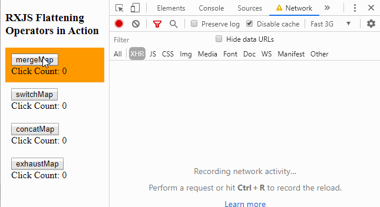
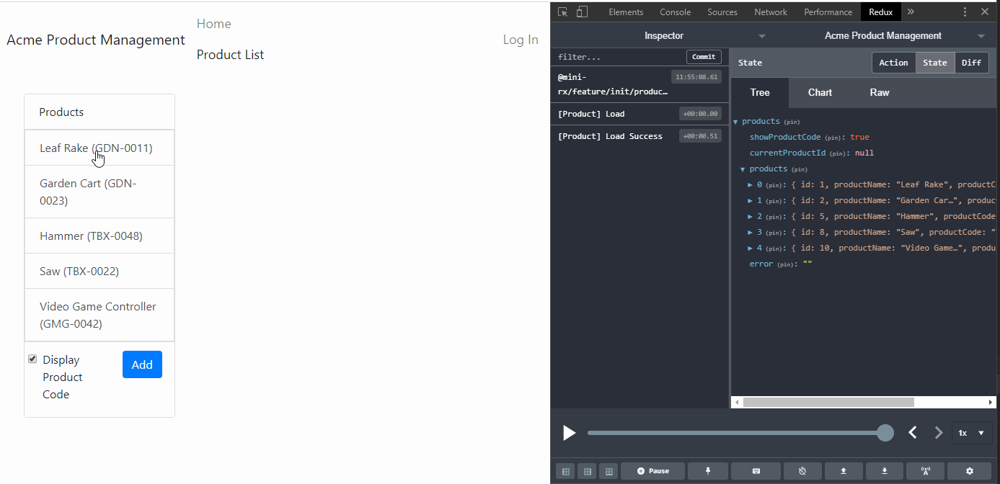

[](https://www.npmjs.com/package/mini-rx-store)
[](https://github.com/spierala/mini-rx-store/actions?query=workflow%3ATests)

# MiniRx: The RxJS Redux Store

**MiniRx Store** provides Reactive State Management for Javascript Applications.

## RxJS

MiniRx is powered by [RxJS](https://rxjs.dev/). It uses RxJS Observables to notify subscribers about state changes.

## Redux

MiniRx uses the Redux Pattern to make state management easy and predictable.

The Redux Pattern is based on this 3 key principles:

-   Single source of truth (the Store)
-   State is read-only and is only changed by dispatching actions
-   Changes are made using pure functions called reducers

## MiniRx Features

-   Minimal configuration and setup
-   "Redux" API:
    -   Actions
    -   Reducers
    -   Memoized Selectors
    -   Effects
-   Support for [ts-action](https://www.npmjs.com/package/ts-action): Create and consume actions with as little boilerplate as possible
-   "Feature" API :
    -   `setState()` update the feature state
    -   `select()` read feature state
    -   `createEffect()` run side effects like API calls and update feature state
-   Support for [Redux Dev Tools](https://github.com/zalmoxisus/redux-devtools-extension)
-   Framework agnostic: Works with any front-end project built with JavaScript or TypeScript (Angular, React, Vue, or anything else)

## Usage

#### Installation:

`npm i mini-rx-store`

#### Create the Store (App State):

The `Store` is created and ready to use as soon as you import `Store`.

`import { Store } from 'mini-rx-store';`

#### Create a Feature (Feature State):

A _feature_ holds a piece of state which belongs to a specific feature in your application (e.g. 'products', 'users').
The feature states together form the app state (Single source of truth).

Usually you would create a new _feature_ inside long living Modules/Services:

```
import { Store } from 'mini-rx-store';
import { ProductState, reducer } from './state/product.reducer';
...
// Inside long living Module / Service
constructor() {
    Store.feature<ProductState>('products', reducer);
}
```

The code above creates a new feature state for _products_.
`Store.feature` receives the feature name, and a reducer function.

Reducers specify how the feature state changes in response to actions sent to the store.
A reducer function typically looks like this:

```
const initialState: ProductState = {
  showProductCode: true,
  products: [],
};

export function reducer(state: ProductState = initialState, action: ProductActions): ProductState {
  switch (action.type) {
    case ProductActionTypes.ToggleProductCode:
      return {
        ...state,
        showProductCode: action.payload
      };

    default:
      return state;
  }
}
```

#### Create an Action:

```
import { Action } from 'mini-rx-store';

export enum ProductActionTypes {
  CreateProduct = '[Product] Create Product',
}

export class CreateProduct implements Action {
  readonly type = ProductActionTypes.CreateProduct;
  constructor(public payload: Product) { }
}
```

#### Dispatch an Action:

Dispatch an action to update state:

```
import { Store } from 'mini-rx-store';
import { CreateProduct } from 'product.actions';

Store.dispatch(new CreateProduct(product));
```

After the action has been dispatched the state will be updated accordingly (as defined in the reducer function).

#### Write an effect:

Effects handle code that triggers side effects like API calls:

-   An Effect listens for a specific action
-   That action triggers the actual side effect
-   The Effect needs to return a new action as soon as the side effect finished

```
import { Action, actions$, ofType } from 'mini-rx-store';
import { mergeMap, map, catchError } from 'rxjs/operators';
import { LoadFail, LoadSuccess, ProductActionTypes } from './product.actions';
import { ProductService } from '../product.service';

constructor(private productService: ProductService) {
    Store.createEffect(
        actions$.pipe(
            ofType(ProductActionTypes.Load),
            mergeMap(() =>
                this.productService.getProducts().pipe(
                    map(products => (new LoadSuccess(products))),
                    catchError(err => of(new LoadFail(err)))
                )
            )
        )
    );
}
```

The code above creates an Effect. As soon as the `Load` action has been dispatched the API call (`this.productService.getProducts()`) will be executed. Depending on the result of the API call a new action will be dispatched:
`LoadSuccess` or `LoadFail`.

#### Create (memoized) Selectors:

Selectors are used to select and combine state.

```
import { createFeatureSelector, createSelector } from 'mini-rx-store';
import { ProductState } from './product.reducer';

const getProductFeatureState = createFeatureSelector<ProductState>('products');

export const getProducts = createSelector(
    getProductFeatureState,
    state => state.products
);
```

`createSelector` creates a memoized selector. This improves performance especially if your selectors perform expensive computation.
If a selector is called with the same arguments again, it will just return the previously calculated result.

#### Select Observable State (with a memoized selector):

```
import { Store } from 'mini-rx-store';
import { getProducts } from '../../state';

this.products$ = Store.select(getProducts);
```

`Store.select` runs the selector against the app state and returns an Observable which will emit as soon as the _products_ data changes.

## ts-action

MiniRX supports writing and consuming actions with [ts-action](https://www.npmjs.com/package/ts-action).

There are also [ts-action-operators](https://www.npmjs.com/package/ts-action-operators) which will help you to consume actions in Effects.

Install the packages using npm:

`npm install ts-action ts-action-operators`

#### Create an Action:

```
import { action, payload } from 'ts-action';

export const createProduct = action('[Product] Create Product', payload<Product>());
```

#### Dispatch an Action:

```
import { Store } from 'mini-rx-store';
import { createProduct } from './../../state/product.actions';

Store.dispatch(createProduct(product));
```

#### Reducer

```
import { on, reducer } from 'ts-action';

export const productReducer = reducer(
    initialState,
    on(toggleProductCode, (state, {payload}) => ({...state, showProductCode: payload}))
);
```

#### Effects

Consume actions in Effects

```
import { Action, actions$, Store } from 'mini-rx-store';
import { ofType, toPayload } from 'ts-action-operators';

updateProduct$: Observable<Action> = actions$.pipe(
    ofType(updateProduct),
    toPayload(),
    mergeMap((product) => {
        return this.productService.updateProduct(product).pipe(
            map(updatedProduct => (updateProductSuccess(updatedProduct))),
            catchError(err => of(updateProductFail(err)))
        );
    })
);
```

## Make simple things simple - The `Feature` API

If a feature in your application requires only simple state management, then you can fall back to a simplified API:
With the `Feature` API you can update state without writing actions and reducers.

#### Create a Feature (Feature State):

To create a `Feature`, you need to extend MiniRx's `Feature` class, passing the feature name as well as its initial state.

```
interface UserState {
    currentUser: User;
    favProductIds: string[];
}

export class UserStateService extends Feature<UserState>{
    constructor() {
        super('users', initialState);
    }
}
```

#### Select state with `select`

**`select(mapFn: (state: S) => any): Observable<any>`**

Example:

```
currentUser$: Observable<User> = this.select(state => state.currentUser);
```

`select` takes a callback function which gives you access to the current feature state (see the `state` parameter).
Inside of that function you can pick a certain piece of state.
`select` returns an Observable which will emit as soon as the selected data changes.

#### Select state (with a memoized selector):

You can use memoized selectors also with the `Feature` API... You only have to omit the feature name when using `createFeatureSelector`.
This is because the `Feature` API is operating on a specific feature state already (the corresponding feature name has been provided in the constructor).

```
const getProductFeatureState = createFeatureSelector<ProductState>(); // Omit the feature name!

const getProducts = createSelector(
    getProductFeatureState,
    state => state.products
);

// Inside the Feature state service
export class ProductStateService extends Feature<ProductState>{
    this.products$ = this.select(getProducts);

    constructor(private productService: ProductService) {
        super('products', initialState); // Feature name 'products' is provided here already...
    }
}
```

#### Update state with `setState`

**`setState(state: Partial<S>, name?: string): void`**

Example:

```
updateUser(user: User) {
    this.setState({currentUser: user});
}
```

`setState` sets the new state of the feature.

```
// Update state based on current state
addFavorite(productId) {
    this.setState({
        favProductIds: [...this.state.favProductIds, productId]
    });
}
```

Do you want to calculate the new state based on the current state?
You can use `this.state` which holds the current state snapshot.

For better logging in the JS Console / Redux Dev Tools you can provide an optional name to the `setState` function:

`this.setState({currentUser: user} 'updateUser');`

#### Create an Effect with `createEffect`

**`createEffect<PayLoadType = any>(effectFn: (payload: Observable<PayLoadType>) => Observable<Partial<S>>, effectName?: string): (payload?: PayLoadType) => void`**

`createEffect` offers a simple way to trigger side effects (e.g. API calls)
and update feature state straight away.

Example:

```
import { catchError, map, mergeMap } from 'rxjs/operators';
import { of } from 'rxjs';

createProduct = this.createEffect<Product>(
    mergeMap((product) =>
        this.productService.createProduct(product).pipe(
            map((newProduct) => ({
                products: [...this.state.products, newProduct],
                currentProductId: newProduct.id,
                error: '',
            })),
            catchError((error) =>
                of({
                    error,
                })
            )
        )
    ),
    'create'
);

// Run the effect
createProduct(product);
```

The code above creates an Effect for _creating a product_.
The API call `this.productService.createProduct` is the side effect which needs to be performed.
`createEffect` returns a function which can be called later to start the Effect with an optional payload (see `createProduct(product)`).

`createEffect` takes 2 arguments:

-   **`effectFn: (payload: Observable<PayLoadType>) => Observable<Partial<S>>`**:
    The `effectFn` is a function that takes an Observable as its input and returns another Observable.
    That is exactly the definition of RxJS operators ([What are operators?](https://rxjs-dev.firebaseapp.com/guide/operators)) :)
    Therefore we can use RxJS (flattening) operators as `effectFn` callback to control how the actual side effect is triggered.
    (e.g. `mergeMap`, `switchMap`, `concatMap`, `exhaustMap`).

    The input of `effectFn` is an Observable which emits the _payload_ argument of the function which starts the Effect
    (e.g. `product` is the payload when calling `createProduct(product)`).

    Finally `effectFn` has to return an Observable with the new feature state.

-   **`effectName: string`**:
    Optional name which needs to be unique for each effect. That name will show up in the logging (Redux Dev Tools / JS console).

**FYI: See how RxJS flattening operators are triggering api calls:**



**FYI: How the Feature API works**

Also the `Feature` API makes use of Redux:
Each feature is registered in the Store (Single source of truth) and is part of the global application state.
Behind the scenes `Feature` is creating a default reducer, and a default action in order to update the feature state.
When you use `setState()` or when the feature´s effect completed, then MiniRx dispatches the default action,
and the default reducer will update the feature state accordingly.

See the default action in the Redux Dev Tools:


## Settings

#### Enable Logging of Actions and State Changes in the Browser Console:

```
import { Store } from 'mini-rx-store';

Store.settings({enableLogging: true});
```

The code above sets the global Store settings.
`enableLogging` is currently the only available setting.
Typically, you would set the settings when bootstrapping the app and before the Store is used.

## Redux Dev Tools:



MiniRx has basic support for the Redux Dev Tools (you can time travel and inspect the current state).
You need to install the Browser Plugin to make it work.

-   [Chrome Redux Dev Tools](https://chrome.google.com/webstore/detail/redux-devtools/lmhkpmbekcpmknklioeibfkpmmfibljd)
-   [Firefox Redux Dev Tools](https://addons.mozilla.org/nl/firefox/addon/reduxdevtools/)

Currently, these options are available to configure the DevTools:

-   `name`: the instance name to be shown on the DevTools monitor page.
-   `maxAge`: maximum allowed actions to be stored in the history tree. The oldest actions are removed once maxAge is reached. It's critical for performance. Default is 50.
-   `latency`: if more than one action is dispatched in the indicated interval, all new actions will be collected and sent at once. Default is 500 ms.

#### Installation (Angular):

[](https://www.npmjs.com/package/mini-rx-ng-devtools)

`npm i mini-rx-ng-devtools`

#### Add DevTools to Angular

```
import { NgReduxDevtoolsModule } from 'mini-rx-ng-devtools';

@NgModule({
    imports: [
        NgReduxDevtoolsModule.instrument({
            name: 'MiniRx Showcase',
            maxAge: 25,
            latency: 1000
        })
    ]
    ...
})
export class AppModule {}
```

#### If you do not use Angular

```
import { Store, ReduxDevtoolsExtension } from 'mini-rx-store';

Store.addExtension(new ReduxDevtoolsExtension({
    name: 'MiniRx Showcase',
    maxAge: 25,
    latency: 1000
}));
```

## Showcases

This Repo contains also two Angular showcase projects.

Run `npm i`

See the MiniRX "Redux" API in action:
Run `ng serve mini-rx-store-showcase-redux --open`

See the MiniRX "Feature" API in action:
Run `ng serve mini-rx-store-showcase --open`

The showcases are based on the NgRx example from Deborah Kurata: https://github.com/DeborahK/Angular-NgRx-GettingStarted/tree/master/APM-Demo5

## References

These projects, articles and courses helped and inspired me to create MiniRx:

-   [NgRx](https://ngrx.io/)
-   [Akita](https://github.com/datorama/akita)
-   [Observable Store](https://github.com/DanWahlin/Observable-Store)
-   [RxJS Observable Store](https://github.com/jurebajt/rxjs-observable-store)
-   [Basic State Managment with an Observable Service](https://dev.to/avatsaev/simple-state-management-in-angular-with-only-services-and-rxjs-41p8)
-   [Redux From Scratch With Angular and RxJS](https://www.youtube.com/watch?v=hG7v7quMMwM)
-   [How I wrote NgRx Store in 63 lines of code](https://medium.com/angular-in-depth/how-i-wrote-ngrx-store-in-63-lines-of-code-dfe925fe979b)
-   [Pluralsight: Angular NgRx: Getting Started](https://app.pluralsight.com/library/courses/angular-ngrx-getting-started/table-of-contents)
-   [Pluralsight: RxJS in Angular: Reactive Development](https://app.pluralsight.com/library/courses/rxjs-angular-reactive-development/table-of-contents)
-   [Pluralsight: RxJS: Getting Started](https://app.pluralsight.com/library/courses/rxjs-getting-started/table-of-contents)

## License

MIT

## Created By

If you like this, follow [@spierala](https://twitter.com/spierala) on twitter.
